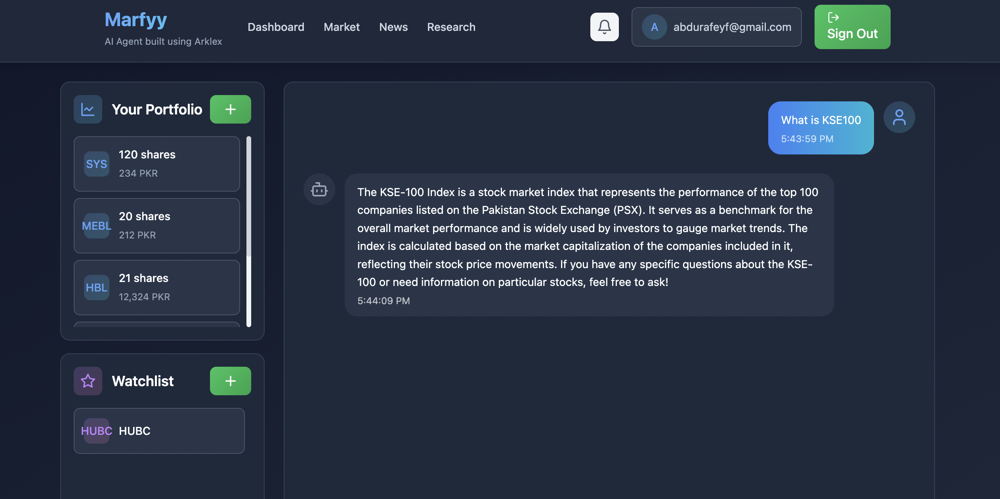

# Financial Service PAK

**Financial Service PAK** is a concise, modular setup using [Arklex AI](https://www.arklex.ai/qa/open-source) to build and deploy an **AI-powered financial assistant**. This repository combines a Node.js/TypeScript **web frontend** (`financeanalyzer/`) with Arklex’s **Taskgraph** orchestrations and worker initialization in Python.



---

## Project Structure

```
financial_service_pak/
├── eval/                # Evaluation
├── financeanalyzer/     # Web frontend (Node.js + Vite)
├── .bolt/
├── node_modules/
├── src/                 # Additional source or integration scripts
├── supabase/            # Supabase integration/config
├── .env                 # Backend environment variables (API keys, etc.)
├── package.json
├── taskgraph.json
└── ...
```

### Main Files
- **`.env`**: Backend environment variables (e.g., `OPENAI_API_KEY`).  
- **`financeanalyzer/.env`**: Frontend environment variables, including Supabase and OpenAI keys:
  ```bash
  VITE_SUPABASE_ANON_KEY=...
  VITE_SUPABASE_URL=...
  VITE_OPENAI_API_KEY=...
  ```
- **`taskgraph.json`, `taskplanning.json`**: Define tasks and agent planning for Arklex.

---

## Quick Start

### 1. Frontend Setup (Financeanalyzer)

1. **Install Dependencies**  
   ```bash
   cd financeanalyzer
   npm install
   ```
2. **Configure .env**  
   - Copy the provided keys into `financeanalyzer/.env`.
3. **Run the Web App**  
   ```bash
   npm run dev
   ```
   - Access the local dev server (usually at [http://localhost:5173](http://localhost:5173)).

### 2. AI Orchestration with Arklex

1. **Install Arklex**  
   ```bash
   pip install arklex
   ```
2. **Generate Taskgraph & Workers**  
   ```bash
   python create.py \
     --config ./financial_service_config.json \
     --output-dir ./financial_service_pak
     --model gpt-4o-mini
   ```
   - Edit the task plan interactively if needed, then save.
3. **Run the Agent**  
   ```bash
   python run.py --input-dir ./financial_service_pak --model gpt-4o-mini
   ```
   - Chat with the financial assistant in your console or via the integrated API.

### 3. Evaluation (Optional)

1. **Create API**  
   ```bash
   python model_api.py --input-dir ./financial_service_pak ----model gpt-4o-mini
   ```
2. **Simulate Conversations**  
   ```bash
   python eval.py \
     --model_api http://127.0.0.1:8000/eval/chat \
     --config ./financial_service_config.json \
     --documents_dir ./financial_service_pak \
     --output-dir ./financial_service_pak
     --model gpt-4o-mini
   ```

---

## Contributing

Feel free to open issues or PRs to enhance **Financial Service PAK**—whether it’s refining the frontend, adding new workers/tools, or extending it.
